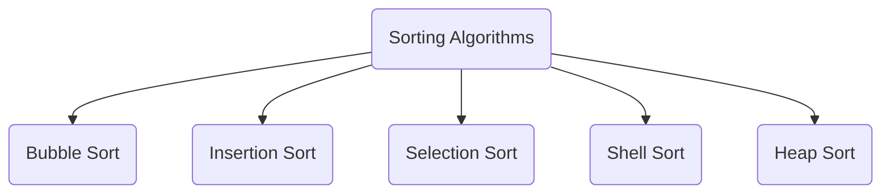

# Data Structures And Algorithms With C++

Every file can be compiled separately.
Means it contains it's own main function.

## Data Structures :-

| Data Structure                                                    |
| ----------------------------------------------------------------- |
| [Stack](https://github.com/ViplavRaja-GIT/Data-Structures-And-Algorithms-With-CPP/blob/main/Data-Structures/Stack/Stack.cpp) |
| [Queue](https://github.com/ViplavRaja-GIT/Data-Structures-And-Algorithms-With-CPP/blob/main/Data-Structures/Queue/Queue.cpp) |
| [Dynamic Array](https://github.com/ViplavRaja-GIT/Data-Structures-And-Algorithms-With-CPP/blob/main/Data-Structures/DynamicArray/DynamicArray.cpp) |
| [Linked List](https://github.com/ViplavRaja-GIT/Data-Structures-And-Algorithms-With-CPP/blob/main/Data-Structures/LinkedList) |
| [Doubly Linked List](https://github.com/ViplavRaja-GIT/Data-Structures-And-Algorithms-With-CPP/blob/main/Data-Structures/DoublyLinkedList/DoublyLinkedList.cpp) |
| [Circular Linked List](https://github.com/ViplavRaja-GIT/Data-Structures-And-Algorithms-With-CPP/blob/main/Data-Structures/CircularLinkedList/CircularLinkedList.cpp) |
| [HashTable](https://github.com/ViplavRaja-GIT/Data-Structures-And-Algorithms-With-CPP/blob/main/Data-Structures/HashTable) |

## Algorithms :-
### [Sorting Algorithms](https://github.com/ViplavRaja-GIT/Data-Structures-And-Algorithms-With-CPP/blob/main/Algorithms/Sorting-Algorithms)

### [Two Pointer Algorithms](https://github.com/ViplavRaja-GIT/Data-Structures-And-Algorithms-With-CPP/blob/main/Algorithms/Two-Pointer-Algorithms)
- [3Sum](https://github.com/ViplavRaja-GIT/Data-Structures-And-Algorithms-With-CPP/blob/main/Algorithms/Two-Pointer-Algorithms/3Sum.cpp)
- [Floyd's-Cycle-Finding](https://github.com/ViplavRaja-GIT/Data-Structures-And-Algorithms-With-CPP/blob/main/Algorithms/Two-Pointer-Algorithms/Floyd's-Cycle-Finding.cpp)