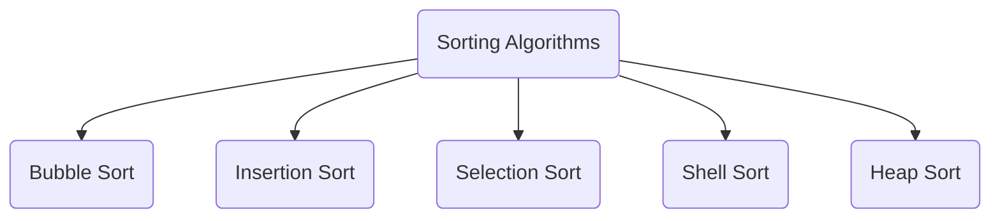

# Data Structures And Algorithms With C++

Every file can be compiled separately.
Means it contains it's own main function.

## Data Structures :-

<table>
    <tr>
        <td>
            <a class="d-s-anchor" href="/Data-Structures/Stack/Stack.cpp">Stack</a>
        </td>
        <td>
            <a class="d-s-anchor" href="/Data-Structures/Queue/Queue.cpp">Queue</a>
        </td>
        <td>
            <a class="d-s-anchor" href="/Data-Structures/DynamicArray/DynamicArray.cpp">Dynamic Array</a>
        </td>
        <td>
            <a class="d-s-anchor" href="/Data-Structures/LinkedList">Linked List</a>
        </td>
        <td>
            <a class="d-s-anchor" href="/Data-Structures/DoublyLinkedList/DoublyLinkedList.cpp">Doubly Linked List</a>
        </td>
    </tr>
    <tr>
        <td>
            <a class="d-s-anchor" href="Data-Structures/CircularLinkedList/CircularLinkedList.cpp">Circular Linked List</a>
        </td>
        <td>
            <a class="d-s-anchor" href="/Data-Structures/HashTable">HashTable</a>
        </td>
        <td></td>
        <td></td>
        <td></td>
    </tr>
</table>

## Algorithms :-
### [Sorting Algorithms](/Algorithms/Sorting-Algorithms)

### [Two Pointer Algorithms](/Algorithms/Two-Pointer-Algorithms)
- [3Sum](/Algorithms/Two-Pointer-Algorithms/3Sum.cpp)
- [Floyd's-Cycle-Finding](/Algorithms/Two-Pointer-Algorithms/Floyd's-Cycle-Finding.cpp)
